# assignment-0-pradiptlx

My assignment for IMK A class

* Akwila Feliciano P 05111740000181

******

## Contents:

1. [Wangsit Education Website](#1-bad-design-and-user-experience-of-wangsit-education-website)

    * [What's bad on this web](#11-bad-things)
    * [Conclusion](#12-conclusion)
    * [Demo](#13-demo)

2. [Anki Desktop Application](#2-anki-desktop-application)

    * [Overview](#21-overview-of-anki)
    * [Conclusion](#22-conclusion)
    * [Demo](#23-demo)

3. [21 Cinema Website](#3-21cineplex-website)

    * [Overview](#31-overview)
    * [Conclusion](#32-conclusion)
    * [Demo](#33-demo)

******

## 1. Bad Design and User Experience of Wangsit Education Website

First of all, I analyze this website from Desktop browser. I visited this website since 2017 and today, the principal design didn't change at all (from my perspective). Wangsit Education Website is categorized to _Online Shopping_. This website sells _SBMPTN, SIMAK UI, UTUL UGM_ books.

### 1.1 Bad things

Let's breakdown the bad side of this website.

1. This website doesn't optimize for desktop experience.

    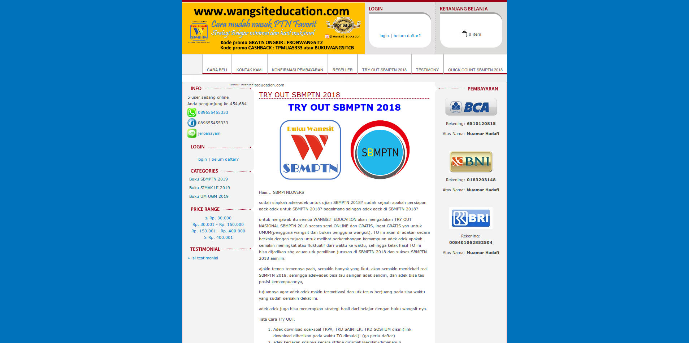

    Website's layout doesn't give modern layout experience. It is a kind of old website design. Navigation bar's padding is too big and text inside _navbar_ not properly fit with its parent (navbar). Login/signup and cart box also doesn't give interesting looks. It's too much padding . Otherwise, cart counter item works as it should be.

2. Homepage only show _new arrival_ books.

    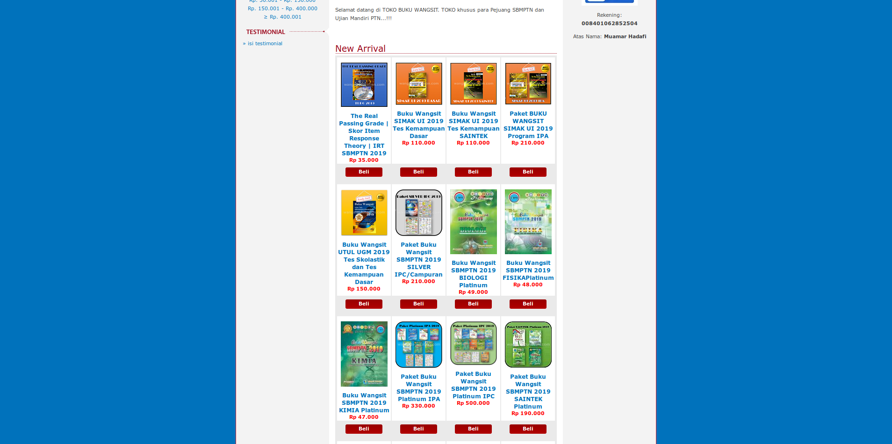

    It is not problem to show new arrival product only but its should give another product on other page. From my opinion, if we can't find another product than what it show on homepage, the homepage caption should not write "_New Arrival_". It just makes an ambiguous to visitor. This is a minor issue, I think.

3. There is no **search product** feature.

    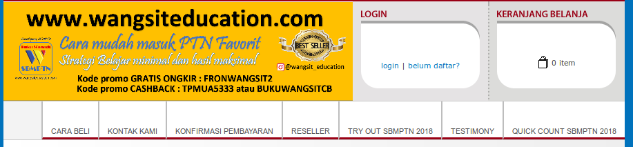

    Most _Online Shopping_ websites give search product feature on their site. It is important to user to give usability on what user wanted from online shop. But this is minor issue considering this website only show new product.

4. A mobile version.

    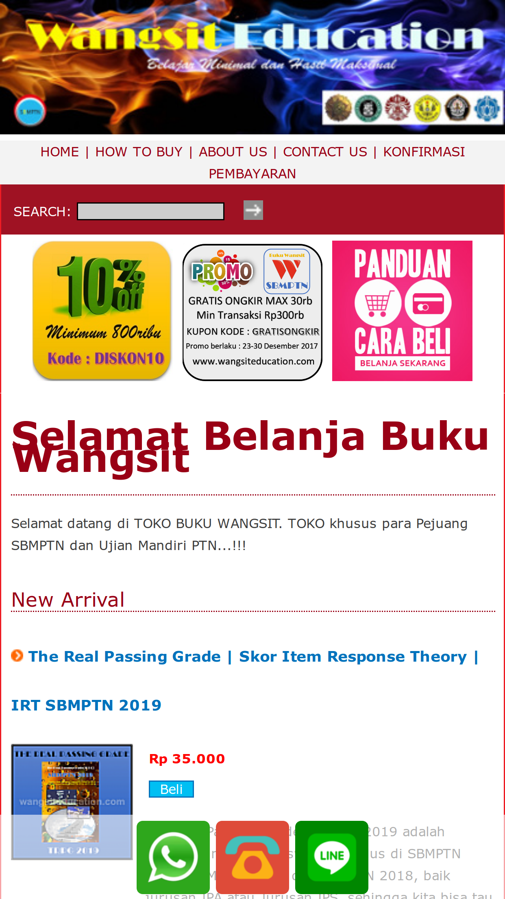

    I curious about what this website looks when browsing using mobile browser. When I visited, there is differences between mobile version and desktop version. First, there is a _search_ product feature on mobile version. Second, website looks **more compact** and a little bit better than desktop version. But it is give inconsistency because there is differences between its two version.

5. No pagination on mobile version.

    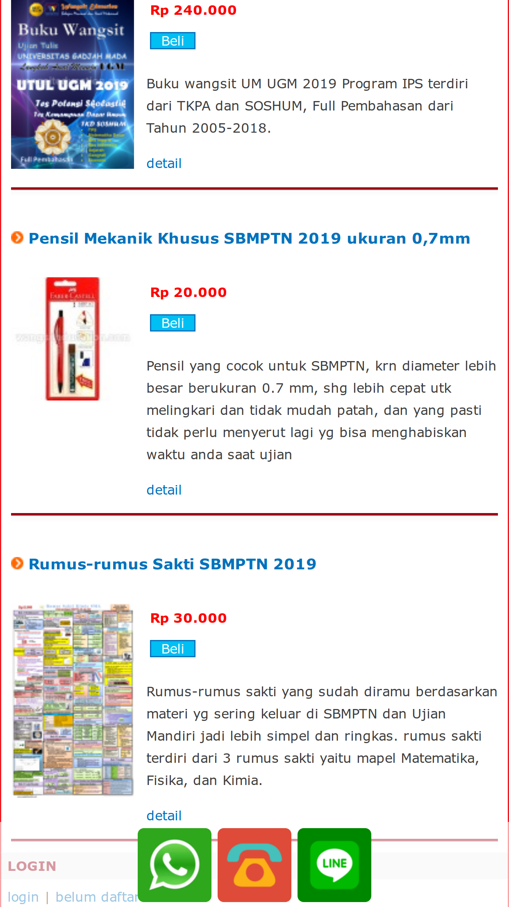

    Pagination is important for simplicity experience. Especially on mobile when scrolling is a bit frustrating when dealing with long content.

6. Useless option.

    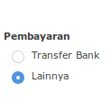

    I don't know what "lainnya" means because this owner only give instruction to pay with _transfer to bank account_. I think its radio button is useless because many visitor will choose "_transfer bank_" option.

7. Inconsistent layout

    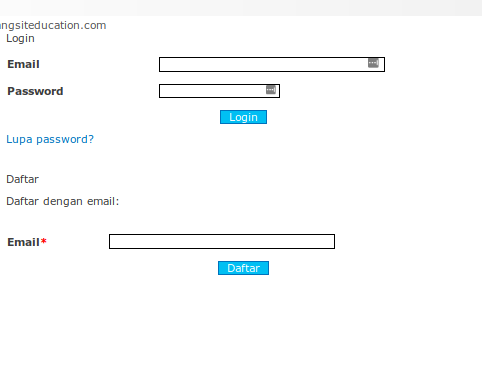

    Form doesn't look good because its layout not fit with other form. Most importantly, whole website has ugly font and font size so its gives difficult to read.

### 1.2 Conclusion

The desktop website's layout should give more consistent and shrink the useless free space (more compact design). Font style and font size also must be fixed for user experience.

### 1.3 Demo

******

## 2. Anki Desktop Application

### 2.1 Overview of Anki

Anki is a spaced repetition flashcard program. It is avaliable on many OS and web version.

In this topics, I use Linux version. This is what it looks on Linux.

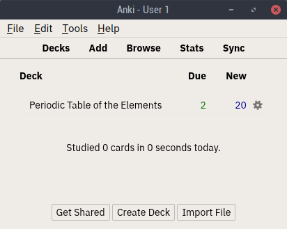

It has simple interface. When I first time used it, I got difficult to create deck or explore other things in this app because its UI. This is what I mean:

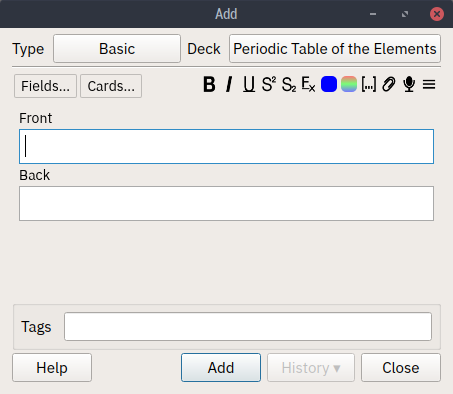

From the website, they said that this app is powerfull because using _LATEX_ to create some scientific card.
>Anyone who needs to remember things in their daily life can benefit from Anki. Since it is content-agnostic and supports images, audio, videos and scientific markup (via LaTeX), the possibilities are endless.

But I have no idea how to create complex card in the first time (because I never use it and didn't read the documentation).

This is some looks of _deck_ :

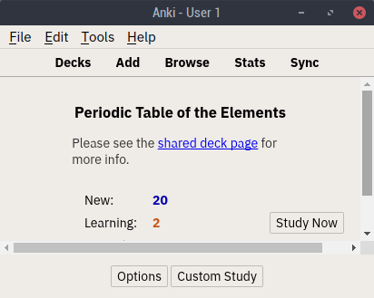

When you click "_study now_":

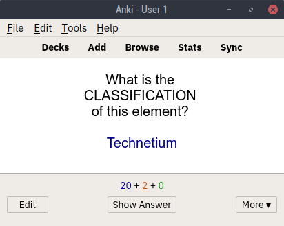
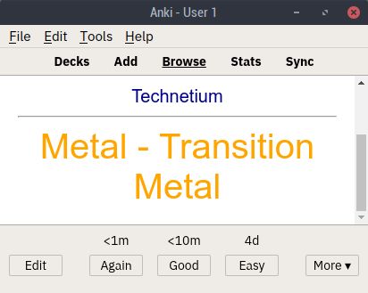

### 2.2 Conclusion

I think for user who use it first time will get difficult to create and using the card. Maybe if the interface better than this and give in-app documentation, this app will more get attention.

### 2.3 Demo

******

## 3. 21Cineplex Website

### 3.1 Overview

### 3.2 Conclusion

### 3.3 Demo